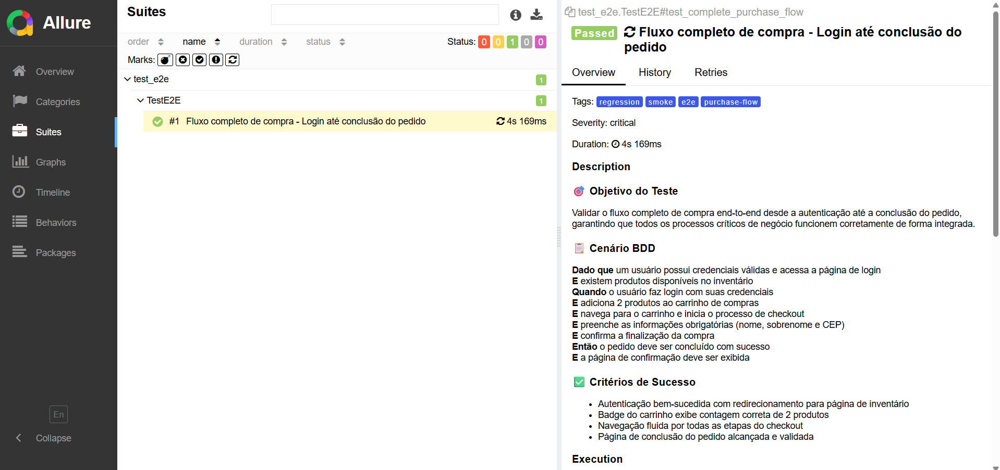
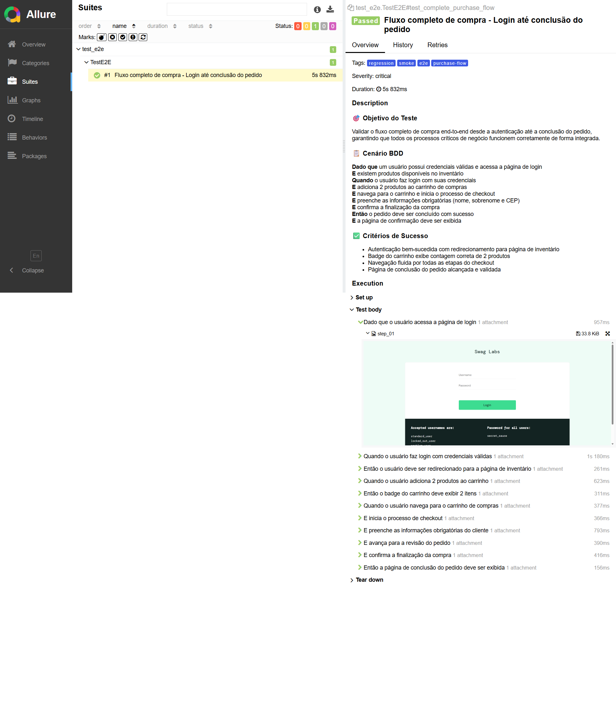

# SauceDemo Test Automation
[](https://github.com/daniloabramo/saucedemo-test-automation/actions/workflows/tests.yml)


Automação de testes end-to-end Web em Selenium com CI/CD integrado no padrão Page Object Model (POM).

Relatórios interativos e deploy automático via GitHub Pages.

Veja e interaja com o relatório [clicando aqui](https://daniloabramo.github.io/saucedemo-test-automation/#suites/17c502858e12ec53894ece266e845cc5/5db9b5bbec89be25/).



## 📋 Sobre o Projeto
Automação de testes end-to-end WEB para SauceDemo utilizando Python, Pytest, Selenium WebDriver, CI/CD e Page Object Model (POM). 

## 📊 Cobertura de Testes
### Login
- ✅ Login com múltiplos usuários válidos (standard, problem, performance_glitch)
- ✅ Validação de usuário bloqueado (locked_out_user)
- ✅ Testes negativos com credenciais inválidas
### Shopping Flow
- ✅ Adição/remoção de múltiplos produtos
- ✅ Validação de contadores de badge
- ✅ Navegação entre páginas
### Checkout
- ✅ Preenchimento dos dados do comprador
- ✅ Validação de URLs em cada etapa
### E2E (Fluxo Completo)
- ✅ Fluxo completo: login → adicionar produtos → checkout → confirmação
- ✅ Preenchimento de formulário de informações
- ✅ Teste crítico com Allure steps detalhados

## 📈 Relatório Allure
Veja e interaja com o relatório [clicando aqui](https://daniloabramo.github.io/saucedemo-test-automation/#suites/17c502858e12ec53894ece266e845cc5/5db9b5bbec89be25/).

O relatório inclui:
- ☑️ Status de execução detalhado
- ☑️ Screenshots automáticos em falhas
- ☑️ Logs de cada passo do teste
- ☑️ Métricas de tempo e tendências
- ☑️ Visualização interativa de resultados 

<details>
<summary>Print do Relatório Allure Fluxo E2E</summary>

</details>

## 🔄 CI/CD Pipeline
Os testes são executados automaticamente via GitHub Actions:

- ✅ A cada push na branch main ou develop
- ✅ A cada Pull Request
- ✅ Manualmente via workflow dispatch

## Padrão Page Object Model
Cada página possui uma classe dedicada com métodos para interação, promovendo:
- ☑️ Reusabilidade de código
- ☑️ Manutenibilidade facilitada
- ☑️ Separação entre lógica de teste e interação com elementos
- ☑️ Redução de código duplicado

## 🛠️ Tecnologias Utilizadas
- **Python** - Linguagem de Programação
- **Selenium WebDriver** - Automação de navegadores
- **Pytest** - Framework de testes 
- **GitHub Actions** - Pipeline de CI/CD
- **Allure Report** - Relatórios interativos
- **POM Pattern** - Organização e manutenibilidade

## 📁 Estrutura do Projeto
``` bash
saucedemo-test-automation/
├── .github/
│   └── workflows/
│       └── tests.yml
├── allure-results/
├── pages/
│   ├── __pycache__/
│   ├── __init__.py
│   ├── base_page.py
│   ├── checkout_page.py
│   ├── login_page.py
│   └── products_page.py
├── tests/
│   ├── __pycache__/
│   ├── __init__.py
│   ├── conftest.py
│   ├── test_checkout.py
│   ├── test_e2e.py
│   ├── test_list_products.py
│   └── test_login.py
├── utils/
│   ├── __init__.py
│   └── locators.py
├── __pycache__/
│   └── conftest.cpython-313-pytest-9.0.2.pyc
├── README.md
└── requirements.txt
```

## 💻 Executar Localmente
### Pré-requisitos
- [Python](https://www.python.org/downloads/release/python-3143/) 3.8+
- [Chrome](https://support.google.com/chrome/answer/95346?hl=pt-BR&co=GENIE.Platform%3DDesktop) ou [Firefox](https://www.firefox.com/pt-BR/?utm_campaign=SET_DEFAULT_BROWSER)
- pip
### Instação
```bash 
# Clone o repositório
git clone https://github.com/daniloabramo/saucedemo-test-automation.git
cd saucedemo-test-automation

# Instale as dependências
pip install -r requirements.txt
```
### Executar Testes
```bash
# Todos os testes
pytest tests/

# Teste específico
pytest tests/test_login.py

# Com relatório Allure
pytest --alluredir=reports/
allure serve reports/
 ```

## 📄 Licença
Este projeto está sob a licença MIT. Veja o arquivo [LICENSE](LICENSE) para mais detalhes.


